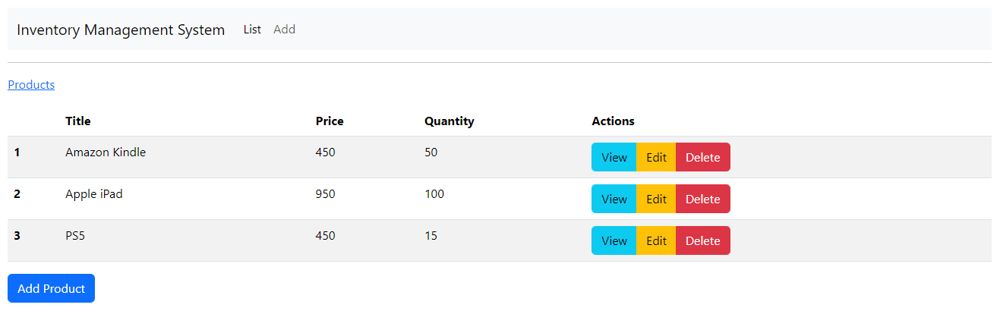
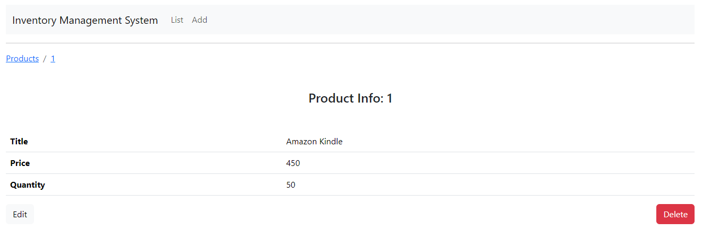
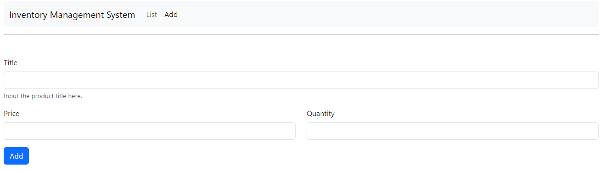
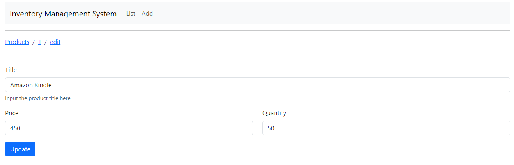

# InvenTrack

## Descripción general

> Este repositorio contiene un sistema de gestión de inventario creado con React para el frontend y Spring Boot para el backend.
>
>> El sistema permite que un administrador de inventario vea, agregue, edite y elimine productos. Cada producto tiene un título, un precio y una cantidad.

### Productos

### Vista del Producto

### Añadiendo un Producto

### Actualizando el Producto

